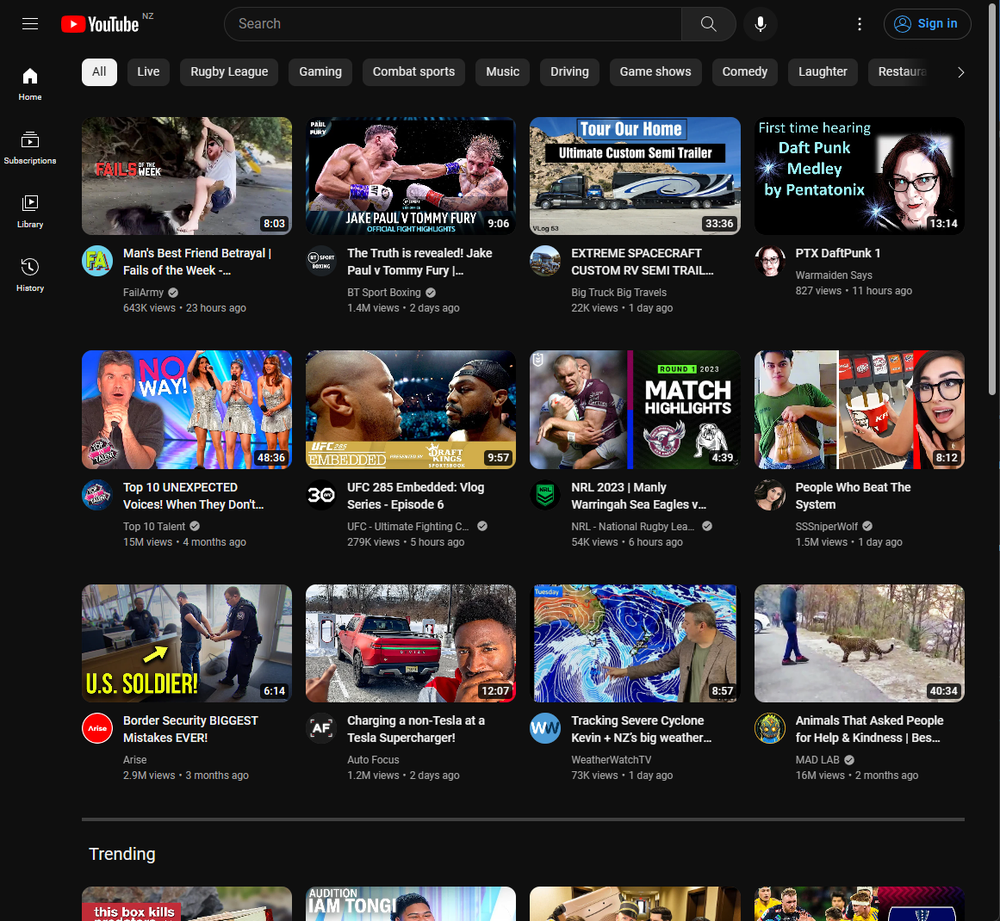

<h1 align="center">yt shortless</h1>

<p align="center">
removes the shorts from YouTube 🙅
</p>
<p align="center">

</p>

### features

- removes the shorts from
  - home
  - navbar
  - subscription box
- configurable

### getting started
to build this application
```
git clone https://github.com/zaccnz/ytshortless.git
cd ytshortless
npm install
```

to develop the extension with HMR
```
npm run dev
```
to build the extension
```
npm run build
```

then load the unpacked extension from the `./dist/` folder.

### technologies

- [Vite](https://vitejs.dev/)  
- [CRXJS](https://crxjs.dev/vite-plugin/)  
- [React](https://reactjs.org/)  
- [Tailwind](https://tailwindcss.com/)  
- [DasiyUI](https://daisyui.com/)  
- [webextension-polyfill](https://github.com/mozilla/webextension-polyfill)  


